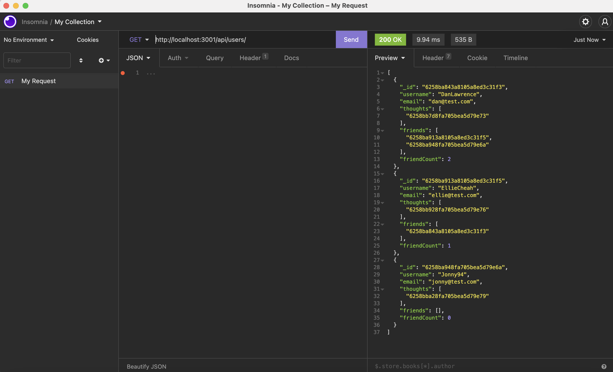
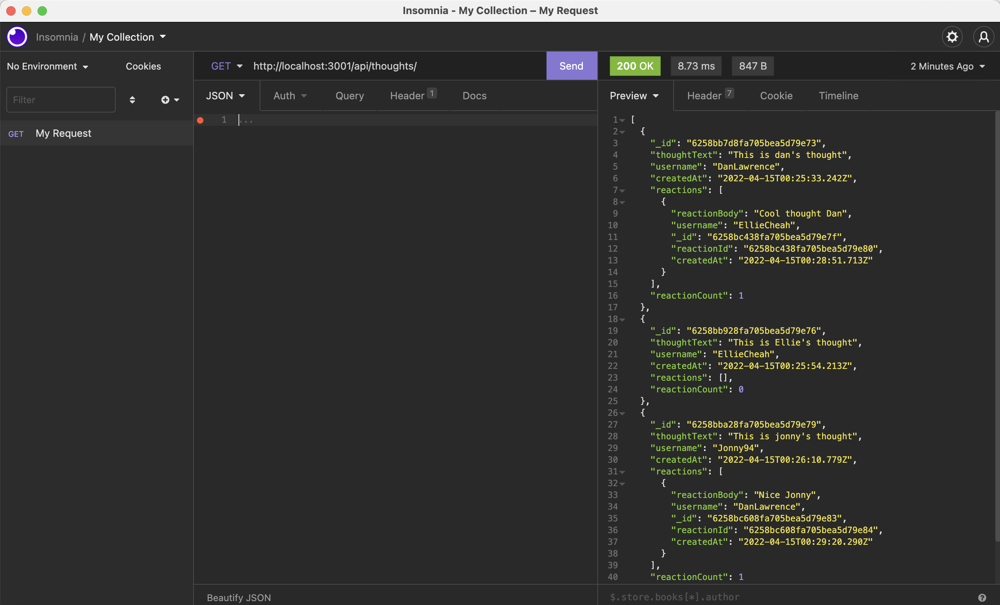
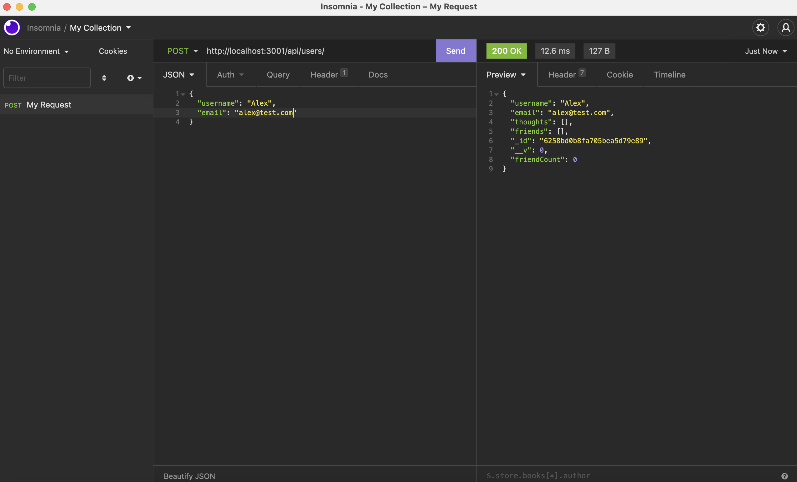
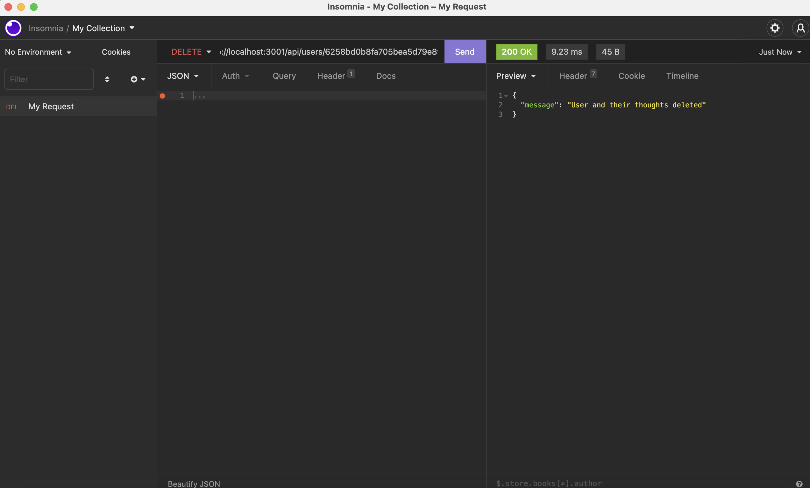

# Social Network API

## Description

This project uses MongoDB and Mongoose to build and structure an API for a social network. Users can share their thoughts, react to their friends thoughts and create a friend list. I have used a NoSQL database due to the unstructured nature of the data.

## Installation

The project will need to be cloned from the github repo, once this is done please run npm install to download the relevant dependencies for the project. After the install has completed running npm start will begin the server to test the API.

To run this project on your computer MongoDB will need to be installed. Also as this is only a backend you will need to test the paths in a testing platform such as Postman or Insomnia.

## Usage

This project shows how the back end of a social network API would function using a NoSQL database. There are different models that interact with each other that allow a user to add or remove friends, to edit their information and to create thoughts. These thoughts can be edited or deleted and a user can react to their friends thoughts. This is done using a CRUD API.

Below are some images of how some of the routes look in Insomnia - I have not included all routes as the premise is the same across both users and thoughts.

This image shows all users being searched for:

This image shows all thoughts being searched for:

This image shows a new user being created:

This image shows a user being deleted:

Here is a link to the walkthrough video - [link](https://drive.google.com/file/d/1jj4eTZu9CXGgaD7khpYW2AMIPhSuJQSx/view)

## Contributing

Contributions are welcome via pull requests. If anything major is to be proposed, please open an issue first to discuss what you would like to change.

## Technology used

For this project I have used:

- JavaScript
- Express
- Moment
- MongoDB
- Mongoose ODM

## Questions

If there are any questions regarding this project please contact me through my email - dan.lawrence0810@gmail.com
Or please visit my GitHub profile which has further contact information - [DanLawrence91](https://github.com/DanLawrence91)
